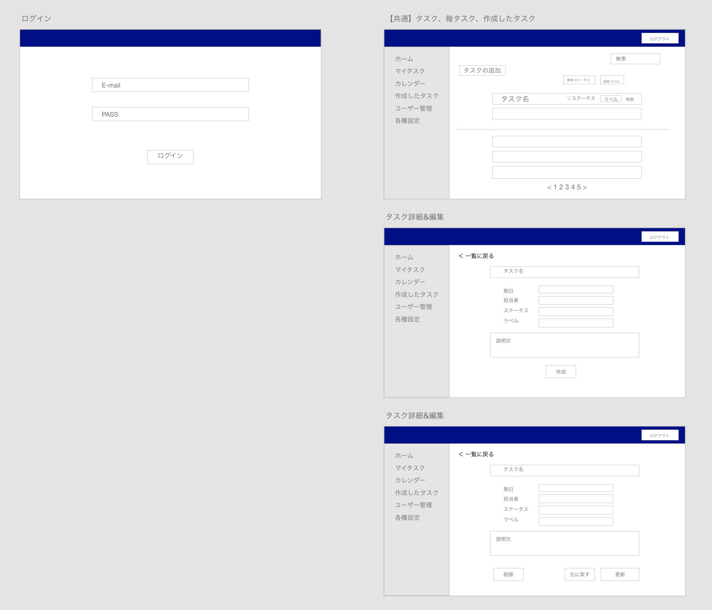

# Rails研修課題アプリ:neko

* Ruby version: 2.7.1
* Rails version: 6.0.2.2
* Mysql version: 5.6

## アプリを起動する方法
1. Ruby 2.7.1のインストール
```
# homebrew, rbenvのインストールをした前提

rbenv install 2.7.1
```

2. Docker上でのMySQLのビルド
```
docker-compose up -d
```

3. ライブラリ(gem)のインストール
```
gem install bundler
bundle install --path 'vendor/bundle'
```
4. データベースの作成とマイグレーション
```
rails db:setup
```

5. nekoの起動
```
rails s
```
6. [localhost:3000](http://localhost:3000/)に接続してタスク一覧が表示されたら成功です。


### エラーについて
```
$ rails s

=> Booting Puma
=> Rails 6.0.2.2 application starting in development
=> Run `rails server --help` for more startup options
RAILS_ENV=development environment is not defined in config/webpacker.yml, falling back to production environment
Exiting
```
このエラーによるとwebpackerがインストールされていないということなので、以下のコマンドを実行してください。

```
# yarnのインストール
brew install yarn

# webpackerをrailsにインストール
rails webpacker:install
```

```
Webpacker successfully installed 🎉 🍰
```
と表示されたら、

```
rails s
```
で起動してみてください。

## 画面遷移図
以下画像は[Adobe_XDで作成したプロトタイプ](https://xd.adobe.com/view/21c0eada-c16b-4efc-477f-39e5affc1df6-57f1/)から



## データベース

